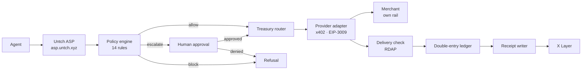
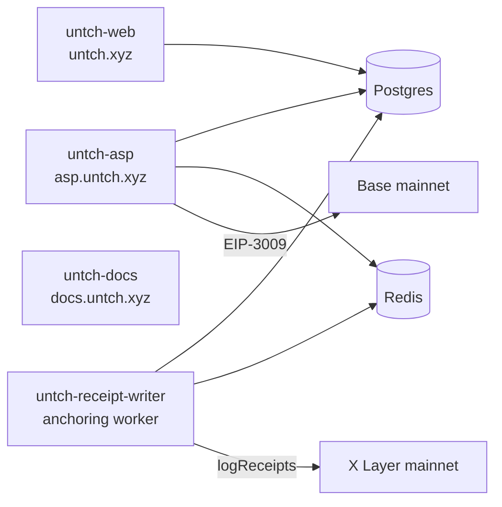

# Untch: The model never touches the money

[](https://github.com/winsznx/untch/actions/workflows/consumer-pack.yml)
[](https://github.com/winsznx/untch/actions/workflows/policy-engine.yml)
[](https://github.com/winsznx/untch/actions/workflows/contracts.yml)
[](#22-running-tests)
[](https://asp.untch.xyz/consumer/catalog)
[](https://docs.untch.xyz)
[](https://okx.ai)
[](LICENSE)

---

> **Production maturity, stated up front.**
>
> The marketplace ASP is live on X Layer mainnet and settles real USDT0. The full agent lifecycle has been completed end to end with real money: an OKX Onchain OS wallet signs in through a TEE, registers a spend policy on the PolicyRegistry contract, and then `preflight_payment` returns an on-chain-anchored APPROVED decision and `verify_delivery` returns a real acceptance verdict — each a paid x402 call that settles on chain. All nine listed services (six paid, three free) have been exercised against production with real settlement.
>
> Untch also completed real production-governed provider settlements in Base USDC, independently verified the delivered domain result through public RDAP data, and generated durable Consumer Pack receipts.
>
> Untch has completed an externally funded Consumer Intent in production. The user funding wallet and Untch provider-settlement treasury are separate, while policy, payment, delivery verification and accounting remain bound to one intent. Providers are currently settled from Untch's pre-funded operational treasury. Receipts currently include durable Untch records and X Layer testnet anchors. Mainnet receipt anchoring is pending writer activation through the contract's three-day timelock.
>
> These boundaries are published rather than hidden. Section 29 lists every limitation.

---

## 1. What this is

**Untch is a deterministic authority layer that decides whether an autonomous agent is allowed to
spend, before any money moves, and proves the decision on-chain afterwards.**

---

## 2. The problem

You want to fund an agent. You do not want to discover, after the fact, that it bought the same thing
eleven times, paid a vendor that never delivered, or drained a wallet because a prompt told it to.

Today the only real control is the balance in the wallet. That is a blast
radius.

---

## 3. Why balance is not authority

A funded wallet answers exactly one question: *can this transaction clear?*

It cannot answer any of the questions that actually matter:

| Question | A balance's answer |
|---|---|
| Is this vendor one we trust? | — |
| Have we already bought this? | — |
| Is this within the per-call cap the human set? | — |
| Is this the eleventh identical call in a minute? | — |
| Did the thing we paid for actually arrive? | — |
| Who authorised this, and can they prove it? | — |

Untch answers all six **before** the money moves, deterministically, and records the answer where
neither party can quietly revise it.

The model proposes. The policy engine decides. **The model never touches the money.**

---

## 4. Product overview

| Layer | What it does | Status |
|---|---|---|
| **Policy engine** | 15 deterministic rules over a bounded SpendIntent. No LLM on the money path. | 🟢 **LIVE**, proven by a paid mainnet decision |
| **Direct-account requester (V3)** | A user's own agent spends under the user's policy with no marketplace identity. Payment proves who paid. A SIWE session proves which account is asking. | 🟢 **LIVE** |
| **Reserved authority vs settled spend** | An approved decision reserves budget. It does not move money, and no surface reports it as spend. | 🟢 **LIVE** |
| **Exact approvals** | The approval digest binds one exact request (amount, recipient, quote, requester and wallet authority). | 🟡 **PARTIAL**: the digest and stores exist and are tested. No approval object is created on the paid account path yet, so nothing reaches a human. The account-scoped approval writer is being completed |
| **Escalation** | Human-in-the-loop over Telegram, Discord, Slack, or the dashboard. | 🔴 **NOT WIRED on the account path, and refused rather than sold**: a request needing human approval returns `APPROVAL_PATH_NOT_READY` (HTTP 503) and **no fee is taken**. The legacy writer still serves the older protocol route. Telegram and Discord delivery have historical proof. Account-scoped `ApprovalRequest` / `ApprovalDelivery` / `ApprovalDecision` are being built now |
| **Delivery verification** | Independent proof that the thing was delivered, not the vendor's word. | 🟢 **LIVE** |
| **Receipts** | Four distinct things, deliberately not collapsed: **decision evidence** (🟢 live, V3, on the paid mainnet path) · **service-payment evidence** (🟢 live, the x402 charge) · **provider-settlement receipt** (🟡 partial, Consumer Pack only) · **on-chain anchored receipt** (🟡 X Layer **testnet**, with mainnet anchoring pending a 3-day writer timelock) | 🟡 **PARTIAL** |
| **Explorer** | Case-first view joining decision, approval, reservation and settlement. | 🟡 **PARTIAL**: ingestion is not built end to end. `activity_cases` is empty |
| **Trust Bureau** | Receipt-backed vendor and buyer scores with a lower-confidence bound. | 🟢 **LIVE** |
| **Consumer Pack** | Governed real-world purchasing across merchant rails. | 🟡 **BETA**, three verified capabilities |
| **UntchVault** | On-chain fund-holding with oracle-signed spend, deployed via VaultFactory. | 🟡 **BETA**, on mainnet but not yet on the production money path |
| **Owned work** (`owned_work.demo`) | A service Untch performs itself. | 🔵 **DECISION_ONLY**: the decision path is live and paid. No owned work has executed in production |
| **A2A** (negotiated, stateful commercial work) | Not started. | ⚪ **NOT_BUILT** |
| **Broker Guard** | Not started. | ⚪ **NOT_BUILT** |

---

## 5. Architecture



**The model is outside the box.** It can propose anything. It cannot widen what the box permits.

---

## 6. Core lifecycle

```mermaid
sequenceDiagram
    participant Agent
    participant Untch
    participant Policy as Policy engine
    participant Human
    participant Merchant
    participant Chain as X Layer

    Agent->>Untch: propose action (bounded intent)
    Untch->>Merchant: quote request (merchant's own 402)
    Merchant-->>Untch: exact price + payTo + TTL
    Untch->>Policy: evaluate 14 rules
    alt within policy
        Policy-->>Untch: ALLOW
    else needs a human
        Policy-->>Untch: ESCALATE
        Untch->>Human: approve this exact amount?
        Human-->>Untch: APPROVED (bound to the quote hash)
    else outside policy
        Policy-->>Untch: BLOCK (named reason)
    end
    Untch->>Untch: fund for the EXACT approved amount
    Untch->>Merchant: pay on the merchant's rail (EIP-3009, single-use)
    Merchant-->>Untch: result
    Untch->>Untch: verify delivery against an independent source
    Untch->>Untch: double-entry ledger — book sums to zero
    Untch->>Chain: anchor receipt
    Chain-->>Agent: publicly checkable receipt
```



---

## 7. Deterministic policy engine 🟢 LIVE

Fifteen rules, evaluated in a fixed order, over a bounded `SpendIntent`. **No LLM call appears
anywhere on the money decision path.** The engine is a pure function of `(intent, policy, decision
window)`. It returns a decision and a PROPOSAL of what committing it would change, and writes
nothing itself.

All fifteen passed on the first paid mainnet decision (2026-08-03):
`policy.active · duplicate.provider_capability_amount_recipient · cooldown.sameService ·
replay.contextBinding · recipient.allowDeny · agent.workerAllowDeny · category.allow ·
vendor.lcbFloor · intent.maxAmountBound · hardCap.absolute · perCall.cap · budget.daily ·
rate.limit · proof.tierRequired · escalate.aboveThreshold`.

`budget.daily` enforces against **effective** usage, meaning settled money plus still-executable
reserved authority. It reports the two separately, so an approved decision is never counted as
spend.

| Rule family | Enforces |
|---|---|
| Budget | daily and rolling-window ceilings per agent |
| Per-call cap | a single call can never exceed the human's limit |
| Category | allow / deny lists over spend categories |
| Recipient | allow / deny lists over payees |
| Agent | which worker agents may act |
| Duplicate | the same task twice inside a TTL is refused |
| Cooldown | minimum gap between calls to the same service |
| Rate limit | calls per hour |
| Expiry | a policy past its expiry authorises nothing |

Every decision returns the rules evaluated and the reason, verbatim, into the receipt.

---

## 8. Exact approvals and mutation rejection 🟡 PARTIAL

> **Status, stated precisely.** The approval digest below is real, implemented and tested: it binds
> the amount, recipient, quote digest, policy id, requester principal and wallet authority, and a
> changed field matches nothing. What is **not** yet live is the production *writer*: an escalated
> decision on the paid route still creates a row in the legacy `escalations` table rather than an
> account-scoped `ApprovalRequest`. `untch_approval_requests` is empty in production. The
> account-scoped writer, delivery and terminal decision are the phase in progress.

An approval does not authorise "a domain purchase". It authorises **one hash**.
```
quoteHash = sha256(canonical quote)
approval  = signature over that hash
```

Change the amount, the recipient, the TTL, or the item, and the hash changes, so the approval no
longer applies and execution refuses. There is no path where a human approves $5 and $500 leaves.

The same binding covers the on-chain side: `spendIntentHash` commits to owner, agent, token,
`maxAmount`, task, acceptance criteria, policy hash, deadline and nonce.

---

## 9. Consumer Pack 🟡 BETA

An agent proposes a real-world action. Untch decides whether it is authorised, funds it for the exact
approved amount, pays the merchant **on the merchant's own rail**, verifies delivery, and produces one
receipt spanning both payments.

Three properties that are unusual and true:

1. **The purchase value is separate from the call fee.** The marketplace price is Untch's
   orchestration fee. Whatever a domain or product costs is funded on its own leg, per intent, for
   exactly the amount a policy authorised.
2. **An ambiguous outcome goes to a human, never to a retry.** If a request leaves Untch and the
   response is lost, the merchant may have acted. The money is parked in a suspense account and a
   human is asked. Resending would be a possible second purchase.
3. **What the merchant says and what Untch proved are reported separately.** A receipt never presents
   a merchant's assertion as an independent verification.

### The ledger

Double-entry, append-only by Postgres `RULE`, and deliberately constrained: **an entry group is
single-asset and sums to exactly zero.** A cross-rail movement is therefore never one group. It is
two, joined by a `CROSS_RAIL_CLEARING` account on each side.

That constraint is what makes "balanced" checkable in SQL. Summing USDT0 on X Layer and USDC on Base
into one figure would require a price, and a ledger whose correctness depends on a price feed is a
ledger that can be made to balance by moving the price.

---

## 10. Consumer Sessions 🟢 LIVE

Reading a tenant's intents requires **proof of policy ownership**, not knowledge of a policy id.
```
POST /consumer/auth/nonce          → server-issued, single-use, expiring nonce
  ↓ sign a SIWE message naming this domain, that nonce, an X Layer chainId,
    and `untch:policy:<policyId>` in Resources
POST /consumer/auth/verify         → 30-minute bearer, bound to the policy
```

Three properties do the work. The nonce is **server-issued**, so a caller cannot pre-sign. It is
**single-use**, enforced by a conditional `UPDATE` rather than read-then-write so two concurrent
replays cannot both win. And it **expires**.

The nonce is consumed *before* the signature is verified. That costs an honest caller one round trip
on failure and costs an attacker the whole attempt. The other order turns signature verification
into a free oracle.

Owning a wallet is not owning a policy: a valid signature from the wrong address is `403
NOT_POLICY_OWNER`, distinct from `401` for a failed proof.

---

## 11. Current live services

All settle **USDT0 on X Layer** (`eip155:196`). The x402 **v2** challenge is carried in the
`payment-required` response header (base64 JSON), and the body is `{}`. A v1 client that only reads the
body will see an empty 402 and wrongly conclude the service is broken.

| Service | Method + path | Price | Status |
|---|---|---|---|
| Rail health | `GET /ping_untch` | $0.01 | 🟢 LIVE |
| Policy preflight | `POST /preflight_payment` | $0.05 | 🟢 LIVE |
| Delivery verification | `POST /verify_delivery` | $0.10 | 🟢 LIVE |
| Vendor score | `POST /score_vendor` | $0.20 | 🟢 LIVE |
| Buyer hygiene score | `POST /score_buyer` | $0.20 | 🟢 LIVE |
| Dispute packet | `POST /generate_dispute_packet` | $0.50 | 🟢 LIVE |
| Spend reconciliation | `POST /reconcile_agent_spend` | $0.25 | 🟢 LIVE |
| Consumer status + public receipt | `GET /consumer/intent/{id}`, `GET /consumer/receipt/{id}` | free | 🟢 LIVE |
| Domain check | `POST /consumer/domains/check` | $0.02 | 🟡 BETA, settled twice |
| Travel search / compare | `POST /consumer/travel/search` | $0.03 / $0.02 | 🟠 EXPERIMENTAL, search only |

---

## 12. Provider maturity matrix

Read live from [`/consumer/catalog`](https://asp.untch.xyz/consumer/catalog). `effectiveMaturity`
takes the **minimum** of provider and capability, so promoting a provider promotes nothing else.

| Provider | Provider maturity | Capability | Capability maturity | Can move money? |
|---|---|---|---|---|
| `stabledomains` | `verified` | `domains.check` | **`verified`** | ✅ **yes, settled twice** |
| `stabledomains` | `verified` | `domains.quote` | `sandbox` | ❌ |
| `stabledomains` | `verified` | `domains.register` / `renew` | `sandbox` | ❌ |
| `stabledomains` | `verified` | `domains.dns` | `experimental` | ❌ |
| `stabletravel` | `sandbox` | `travel.search` / `compare` | `sandbox` | ❌ |
| `stableemail` | `sandbox` | `notify.*` | `sandbox` | ❌ |
| `purch` | `experimental` | `shop.*` | `experimental` | ❌ |
| `stablemerch` | `experimental` | `gifts.*` | `experimental` | ❌ |

> **Explicitly not live:** domain *registration*, shopping, gift ordering, travel *booking*,
> notification sending, Solana settlement, Tempo/MPP settlement. Each is implemented, gated, and
> **refuses with a named reason**. `execution.providersExecutableToday` on the live catalog is
> `["stabledomains"]` and nothing else.

---

## 13. Live production proof

Two real settled provider executions. Both paid **0.050000 USDC on Base** from the Untch settlement
float to StableDomains' own `payTo`, under an EIP-3009 authorisation scoped to one amount and one
recipient.

Untch has completed an externally funded Consumer Intent in production. The user funding wallet and Untch provider-settlement treasury are separate, while policy, payment, delivery verification and accounting remain bound to one intent. Providers are currently settled from Untch's pre-funded operational treasury. The externally funded intent flow is implemented and undergoing final
production proof.

| Intent | Settlement transaction | Block | Driven by |
|---|---|---|---|
| `ci_50a37ce77505690e8b45df13` | [`0xe7ce102f7a704e9c3113fc7fcc8626db8a9cdc330e614d023c231e88fce21e86`](https://basescan.org/tx/0xe7ce102f7a704e9c3113fc7fcc8626db8a9cdc330e614d023c231e88fce21e86) | 49196541 | live smoke driver |
| `ci_82bb2216c02366bc1b839a00` | [`0x6815d60e1be688451d36007a4113f858e0a10433dccef01dc3b3d0f8d283e489`](https://basescan.org/tx/0x6815d60e1be688451d36007a4113f858e0a10433dccef01dc3b3d0f8d283e489) | 49201380 | **the deployed production worker** |

**Delivery was verified against public RDAP**, a source that is not the merchant. The merchant's own
claim and Untch's independent check are reported as two separate fields and never merged.

The whole double-entry book sums to **exactly zero on both rails** after both executions.

### Receipt anchoring, stated precisely

The base contracts are deployed on X Layer **mainnet**. Receipt *anchoring* to date has happened on
X Layer **testnet**: the 20 confirmed receipts are testnet transactions against the testnet
`UntchReceipts` at `0x0c64997277b7d94d2999dea22a123cac56334863`.

The receipt for `ci_82bb2216c02366bc1b839a00` is `ANCHOR_FAILED` and the public receipt says so. The
worker now targets the mainnet contract, where the writer key is **not yet an authorised writer**.
and the contract gates writer-set changes behind a **3-day immutable timelock** (259200s), which is
the control working as designed rather than a bug. Until an admin proposal completes that delay, new
receipts stay durable and unanchored, and every surface reports `ANCHOR_FAILED` rather than implying
an anchor that does not exist.

**The ledger is authoritative either way.** Anchoring is publication, not truth.

---

## 14. X Layer contracts 🟢 LIVE (mainnet)

| Contract | Address |
|---|---|
| PolicyRegistry | [`0xa2177e6d8682367637a3c2af53e2cf8088efa954`](https://www.oklink.com/x-layer/address/0xa2177e6d8682367637a3c2af53e2cf8088efa954) |
| SpendIntentRegistry | [`0x9c1f89dfddd9ae1f9adda4b30ff338e2aa2db202`](https://www.oklink.com/x-layer/address/0x9c1f89dfddd9ae1f9adda4b30ff338e2aa2db202) |
| UntchReceipts | [`0xb5b853684624aea2ecbcd0e888cbff46ff0a5f95`](https://www.oklink.com/x-layer/address/0xb5b853684624aea2ecbcd0e888cbff46ff0a5f95) |
| VaultFactory | [`0x6cc3bc686a7bc554dbd5636cb3eeee9171036805`](https://www.oklink.com/x-layer/address/0x6cc3bc686a7bc554dbd5636cb3eeee9171036805) |

All four are **live on X Layer mainnet**, verified by reading bytecode at each address.
`VaultFactory` deploys `UntchVault` instances (fund-holding, EIP-712 oracle-signed spend, gated on a
cross-contract APPROVED-intent check against the real `SpendIntentRegistry`).

**UntchVault is on mainnet but is not yet on the production money path.** The Consumer Pack settles
from operator-held floats today, not from vaults. That is a sequencing decision, not a limitation of
the contract.

None of the four **base** contracts holds funds. There is no `payable`, no `receive`, no `fallback`
(invariant I4). A deployed `UntchVault` does hold ERC-20 by design, and only ERC-20: it has no
payable, receive or fallback either, so it cannot take native OKB.

---

## 15. Base settlement evidence

Settlement happens on the **merchant's** rail, not ours. StableDomains prices in USDC on Base
(`eip155:8453`), so Untch holds a pre-funded USDC float there and pays from it.

- **Untch Base settlement float:** [`0x0e79371813e88F31c2B60C80bad391a952039095`](https://basescan.org/address/0x0e79371813e88F31c2B60C80bad391a952039095)
- **StableDomains payTo:** `0xABcb091D90419E1c8AD4818f1B33FC4645501892`
- **Mechanism:** EIP-3009 `transferWithAuthorization`, with an exact amount, an exact recipient, `validAfter`/
  `validBefore`, single-use 32-byte nonce. **No ERC-20 `approve` is ever issued**, so there is no
  standing allowance for anyone to drain.

There is **no bridge and no swap on the request path**. Replenishing a float is a documented manual
operator step, recorded as a `TREASURY_TRANSFER` group pair.

---

## 16. Public receipts 🟡 PARTIAL

> **Four different things, and they are not interchangeable.** *Decision evidence* is live: the V3
> record of what was judged and why, on the paid mainnet path. *Service-payment evidence* is live:
> the x402 charge for using Untch. *Provider-settlement receipts* exist for Consumer Pack only.
> *On-chain anchoring* is X Layer **testnet**. Mainnet anchoring waits on a 3-day writer timelock.
> A page that showed one and implied the others would be the same defect this section is correcting.

Every completed action has a receipt anyone can open, with no account:

```bash
curl -s https://asp.untch.xyz/consumer/receipt/ci_82bb2216c02366bc1b839a00 | jq
```

Or as a page: **https://untch.xyz/receipt/ci_82bb2216c02366bc1b839a00**

The public view is built by **naming** the fields that may be published, never by deleting fields
from the private one, so a field added later cannot silently become public. The request payload, the
correlation id and which operator channel resolved an approval are all withheld.

The anchor is **five distinguishable states**, not a nullable id:

| State | Meaning |
|---|---|
| `NOT_RECORDED` | completed, but no receipt was written. Carries the reason |
| `PENDING` | durable and queued for the next batch. Nothing is wrong |
| `ANCHORED` | on chain, with `txHash` and `blockNumber` |
| `ANCHOR_FAILED` | the writer gave up. **The payment and delivery facts are unaffected** |
| `NOT_FOUND` | the intent names a receipt that does not exist. An inconsistency, not a wait |

---

## 17. OKX.AI, ASP #6086

Untch is listed on OKX.AI as **ASP #6086**, ERC-8004 agent **#6047**.

- ERC-8004 registration card: [`/agent-registration.json`](https://asp.untch.xyz/agent-registration.json)
- Full catalog: [`/catalog`](https://asp.untch.xyz/catalog)
- Consumer Pack catalog with real maturity: [`/consumer/catalog`](https://asp.untch.xyz/consumer/catalog)

Point a reviewer at `/consumer/catalog`: it reports each provider's **actual** maturity and
`execution.providersExecutableToday`, so any claim here can be checked against the machine rather
than against this document.

---

## 18. Repository structure
```
contracts/               Solidity — PolicyRegistry, SpendIntentRegistry, UntchReceipts, UntchVault
packages/
  canon/                 RFC 8785 canonical JSON + hashing
  policy-engine/         the 15 deterministic rules — pure, no I/O, returns a proposal
  policy-store/          policies, on-chain owner binding
  receipt-writer/        durable receipts → batching → X Layer anchoring
  escalation/            §7.2 approvals across 4 channels + the §27 authority boundary
  trust-bureau/          receipt-backed vendor + buyer scoring
  proof-engine/          delivery verification tiers
  consumer-core/         money, the 22-state intent machine, the double-entry ledger
  consumer-providers/    x402 v2 / MPP / SIWX clients + merchant adapters
  reports/               dispute packets, spend reconciliation
services/asp/            the x402 seller — every paid route
apps/web/                operator dashboard, explorer, public receipts
apps/docs/               docs.untch.xyz
scripts/                 operational tooling, live probes, soak tests
internal/                audits, evidence, runbooks
```

---

## 19. Local development

```bash
git clone https://github.com/winsznx/untch.git
cd untch
pnpm install
cp .env.example .env      # fill in what you need; every secret placeholder is empty
pnpm typecheck
pnpm test:consumer-core
```

Requires Node ≥ 22.4 and pnpm 10. Postgres and Redis are needed only for the durable paths.

---

## 20. Environment variables

Every switch is **fail-closed**: only the exact strings `1` and `true` enable anything. A typo, an
empty string, `false`, `yes`, `on`, or an unset variable all mean **off**.

| Variable | Purpose |
|---|---|
| `DATABASE_URL` / `REDIS_URL` | durability. Without them the Consumer Pack answers 503 with a named reason |
| `AUTH_SECRET` / `CONSUMER_AUTH_SECRET` | signs dashboard and Consumer Session tokens |
| `CONSUMER_AUTH_REQUIRED` | `1` ⇒ scoped reads require a proven session |
| `CONSUMER_PACK_ENABLED` | master switch for every `/consumer/*` route |
| `CONSUMER_EXECUTION_ENABLED` | the spend switch. **Defaults OFF** |
| `CONSUMER_PROVIDER_<ID>_ENABLED` | per-provider |
| `CONSUMER_BASE_ENABLED` *(or `CONSUMER_CHAIN_EIP155_8453_ENABLED`)* | per-rail |
| `CONSUMER_BASE_USDC_ENABLED` *(or `CONSUMER_ASSET_EIP155_8453_USDC_ENABLED`)* | per-token |
| `CONSUMER_TREASURY_*_PRIVATE_KEY` | settlement float signers, never in the repo |
| `WRITER_PRIVATE_KEY` | the receipt anchoring signer |

Both flag spellings are read. The CAIP-derived name is canonical and **wins where explicitly set**,
so a canonical `=0` cannot be re-enabled by a stale friendly `=1`.

---

## 21. Database migrations

Forward-only, numbered `NNN_name.sql`, each applied once and recorded in a shared
`schema_migrations` table under one advisory lock, so several packages can migrate the same database
concurrently.
```
001_init            receipts + ledger entries
002_policies        policy store
003_escalations     approvals
004_operators       operator identities
005_verify_provenance
006_score_snapshots trust bureau
007_consumer_pack   intents, quotes, executions, treasury, double-entry ledger
008_cross_rail_clearing
009_consumer_auth   single-use SIWE nonces
```

The ledger is **append-only by database RULE**, not by convention: `UPDATE` and `DELETE` on
`consumer_ledger_entries` are rejected by Postgres, so a correction must be a reversing entry that
stays visible.

---

## 22. Running tests

```bash
pnpm typecheck
pnpm test:canon           pnpm test:policy          pnpm test:proof
pnpm test:asp             pnpm test:receipt-writer  pnpm test:escalation
pnpm test:web             pnpm test:trust-bureau
pnpm test:consumer-core   pnpm test:consumer-providers
```

**671 tests, zero failures.** Contracts run their own Foundry pipeline: unit + fuzz + adversarial
invariants, 100% branch coverage, Slither and Aderyn clean, gas snapshots committed.

---

## 23. Security model

| Boundary | How it is held |
|---|---|
| **The model never touches the money** | the engine is a pure function. No LLM call on the decision path |
| **Adapters never hold a key** | they get a `PaymentCapability` scoped to one intent, one asset, one ceiling and one recipient allowlist, redeemed once under a row lock *before* signing |
| **No standing allowance** | EIP-3009 single-use authorisations. `approve` is never called |
| **SSRF** | a provider base URL comes only from the registry table. Nothing user-supplied becomes a fetch target |
| **Tenant isolation** | every read goes through `getIntentForTenant`. Scope requires a SIWE ownership proof |
| **Replay** | server-issued, single-use, expiring nonces, consumed before verification |
| **CSRF** | `SameSite=Lax` plus an explicit `Origin`/`Referer` check that also rejects sibling subdomains |
| **Append-only audit** | Postgres RULEs reject `UPDATE`/`DELETE` on ledger entries |
| **Contracts hold no funds** | no `payable`, `receive` or `fallback` on any base contract |

---

## 24. Threat model

| Threat | Control | Residual |
|---|---|---|
| Prompt injection widens a spend | the engine never reads model output. It reads a bounded struct | none on the decision path |
| Compromised agent replays an approval | approval binds to `quoteHash`. Mutation invalidates it | none |
| Attacker reads another tenant's intents | SIWE ownership proof against the on-chain policy owner | `CONSUMER_AUTH_REQUIRED` must be on |
| Merchant claims delivery falsely | independent verification (RDAP / HTTP probe), reported separately | verification is not available for every capability |
| Merchant charges twice | single-use EIP-3009 nonce, plus idempotency keys | none |
| Lost response after payment | intent → `MANUAL_REVIEW`, money parked in suspense, **never auto-retried** | needs a human |
| Treasury key compromise | capability scoping limits blast radius per call | key compromise is still total for that float |
| Operator key compromise | two-step ownership transfer, and pause is immediate | owner compromise is total by design, and documented |
| Receipt anchoring fails | ledger stays authoritative. `ANCHOR_FAILED` is reported honestly | needs an operator re-drive |

**Untch is a custodial ledger between funding and completion.** It holds value as an operator during
that window. It is not trustless and the documentation says so.

---

## 25. Emergency controls

Two independent layers, because a deploy is sometimes too slow.

**Environment flags** (needs a deploy):

```bash
railway variables --service untch-asp --set "CONSUMER_EXECUTION_ENABLED=0"
railway redeploy --service untch-asp --yes
```

**Database pauses** (immediate, no deploy) are `consumer_pauses` rows scoped globally, per chain or per
provider, checked on **every** capability issuance.

Scope ladder: everything → all spending → one provider → one rail → one token.

---

## 26. Deployment architecture



The ASP only ever **enqueues** receipts. It never holds the anchoring key and never touches the
chain. The worker is the only component with `WRITER_PRIVATE_KEY`.

---

## 27. API examples

**Rail health**, the cheapest proof the x402 rail works:

```bash
curl -i https://asp.untch.xyz/ping_untch
# HTTP/2 402
# payment-required: <base64 x402 v2 challenge>
```

**Policy preflight**, the core product, $0.05:

```bash
curl -X POST https://asp.untch.xyz/preflight_payment \
  -H 'content-type: application/json' \
  -d '{"policyId":"...","intent":{...}}'
```

**Public receipt**, free and unauthenticated:

```bash
curl -s https://asp.untch.xyz/consumer/receipt/ci_82bb2216c02366bc1b839a00 | jq '.settlement, .delivery, .receipt'
```

---

## 28. A2MCP examples

**Discover what is actually executable:**

```bash
curl -s https://asp.untch.xyz/consumer/catalog | jq '.execution, .auth'
```

**Obtain a Consumer Session:**

```bash
curl -X POST https://asp.untch.xyz/consumer/auth/nonce -H 'content-type: application/json' -d '{}'
# sign the SIWE message, then:
curl -X POST https://asp.untch.xyz/consumer/auth/verify \
  -H 'content-type: application/json' \
  -d '{"message":"...","signature":"0x..."}'
```

**Check a domain under policy** (🟡 BETA, and this one really settles):

```bash
curl -X POST https://asp.untch.xyz/consumer/domains/check \
  -H 'content-type: application/json' \
  -d '{"policyId":"...","ref":"example.xyz"}'
```

---

## 29. Current limitations

Stated plainly, because a reviewer will find them anyway.

1. **Three verified consumer capabilities.** `stabledomains × domains.check`,
   `stableemail × mail.send` and `stableemail × mail.inbox.buy`. Everything else refuses.
2. **An externally funded Consumer Intent has completed in production.** The funding wallet
   `0xC8f0…23d4` is not any Untch treasury. Policy, payment, delivery verification and accounting
   stayed bound to one intent. Providers are settled from Untch's pre-funded operational float, so
   Untch is still the settler even when it is not the funder.
3. **Custodial between funding and completion.** Not trustless.
4. **Delivery verification is not universal.** RDAP works for domains. Other categories fall back to
   provider attestation, which is labelled as such and never presented as independent.
5. **Solana and Tempo/MPP are not executable.** The payload serialisation could not be confirmed from
   an authoritative source for Solana. MPP is parsed but not settleable.
6. **UntchVault is deployed on mainnet but not yet on the production money path.** The Consumer Pack
   settles from operator floats. Vault-backed settlement is sequenced after it.
7. **Mainnet receipt anchoring is not yet enabled.** The writer key is not an authorised writer on the
   mainnet `UntchReceipts`, and the contract's writer-set timelock is an immutable **3 days**. All 20
   confirmed receipts to date are **X Layer testnet** anchors. New receipts stay durable and report
   `ANCHOR_FAILED` honestly. The ledger is authoritative regardless, because anchoring is publication, not
   truth.

---

## 30. Roadmap

🔵 **ROADMAP. None of the following is live.**

- Promote `domains.register` after a verified registration settlement
- Solana settlement once the x402 payload serialisation is authoritatively confirmed
- Tempo / MPP settlement
- Gift ordering once the SIWX identity leg is accepted by the provider's verifier
- Travel **booking**, which needs a provider that actually sells inventory
- Move Consumer Pack settlement onto vault-backed floats
- Multi-tenant operator accounts beyond the policy-owner model

---

## 31. Documentation and links

| | |
|---|---|
| Product site | https://untch.xyz |
| Docs | https://docs.untch.xyz |
| Public receipts explorer | https://untch.xyz/explorer |
| Changelog | https://untch.xyz/changelog |
| Consumer Pack proof | https://docs.untch.xyz/consumer-pack-proof |
| Live ASP catalog | https://asp.untch.xyz/catalog |
| Consumer Pack catalog | https://asp.untch.xyz/consumer/catalog |
| ERC-8004 card | https://asp.untch.xyz/agent-registration.json |
| OKX.AI | ASP #6086 · agent #6047 |

---

## 32. Licence

[Apache License 2.0](LICENSE).
